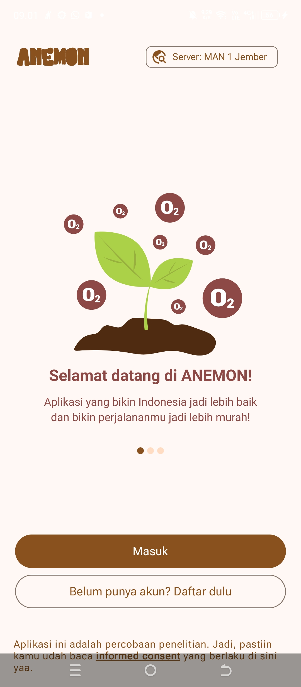
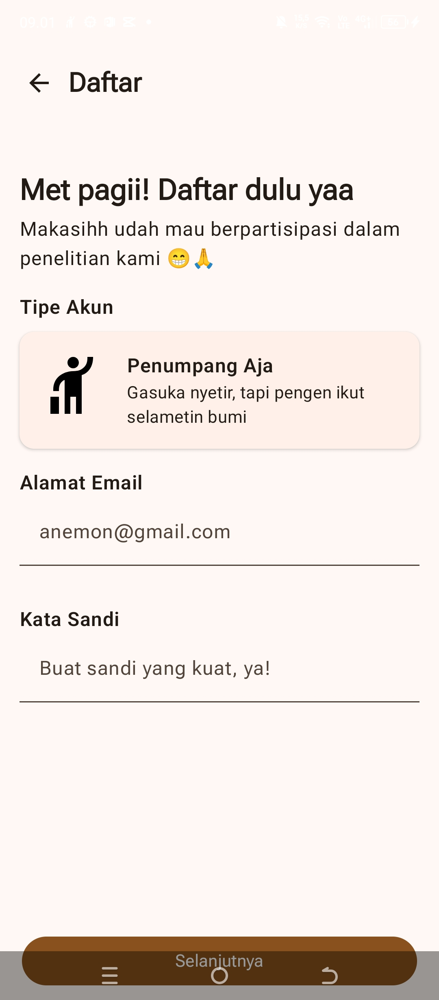
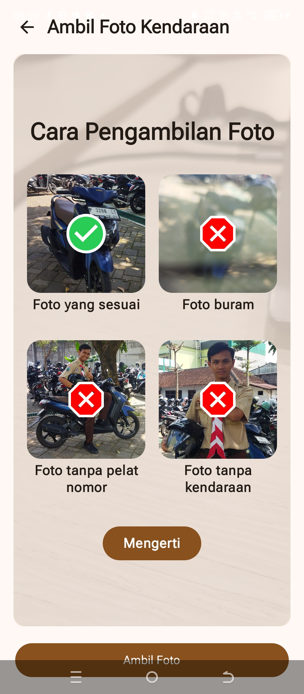
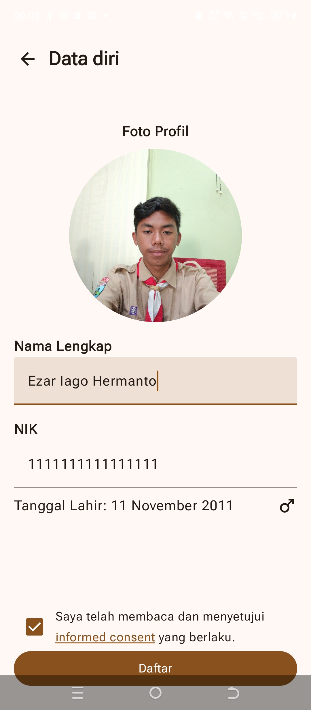
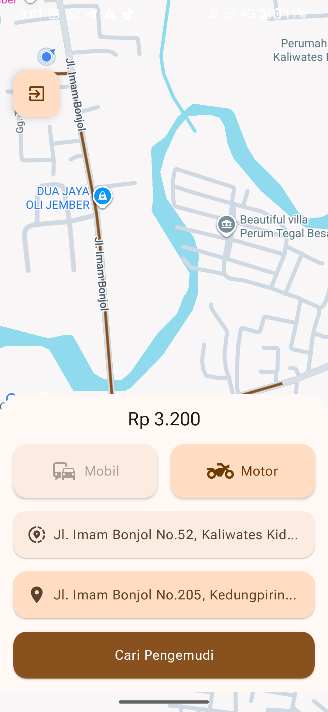
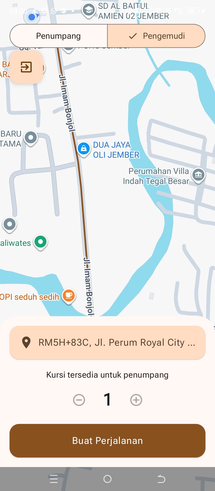
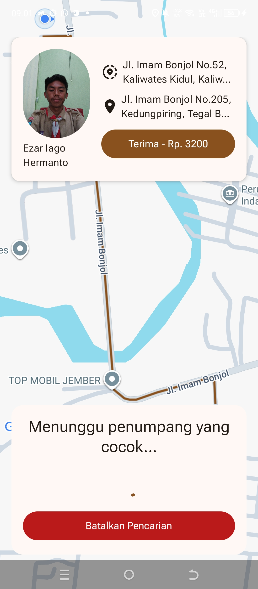
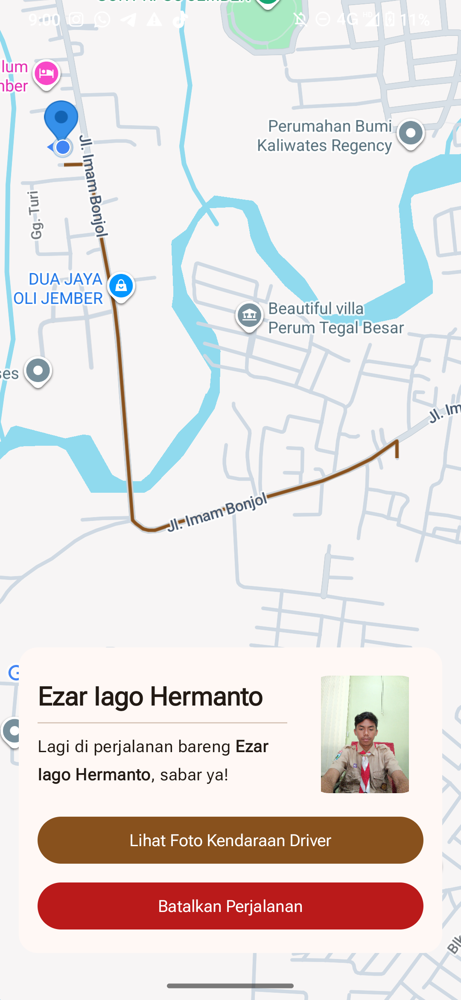

# ANEMON 
 
ANEMON adalah _proof-of-concept_ (POC) sistem bagi tumpangan (_carpooling_) yang dituangkan dalam bentuk aplikasi. Aplikasi ini dibuat khususnya untuk memenuhi proyek riset perlombaan OPSI (Olimpiade Penelitian Siswa Indonesia).

Aplikasi ini memiliki 2 komponen, frontend (sebagai client) dan [backend](https://github.com/ezariago/anemon-backend) (sebagai server).

Frontend dibuat menggunakan framework Jetpack Compose, dengan memanfaatkan Google Maps SDK for Android untuk pemetaannya.

Kode ini bersifat <u>sangat experimental</u>, namun sudah membuktikan penerapan konsep carpooling yang dapat diterapkan secara masif di Indonesia

---
## Tangkapan Layar (_Screenshot_)

### UPDATE 16/3/2026:
Sayangnya, kami tidak memenangkan lomba OPSI 2025, sehingga kode ini akan digunakan sebagai arsip atas aplikasi yang saya dan kolega saya buat. Kami berharap aplikasi ini dapat menjadi inspirasi bagi developer lain untuk membuat aplikasi serupa yang lebih baik di masa depan. Terima kasih banyak kepada semua orang yang telah mendukung kami selama proses pengembangan aplikasi ini!